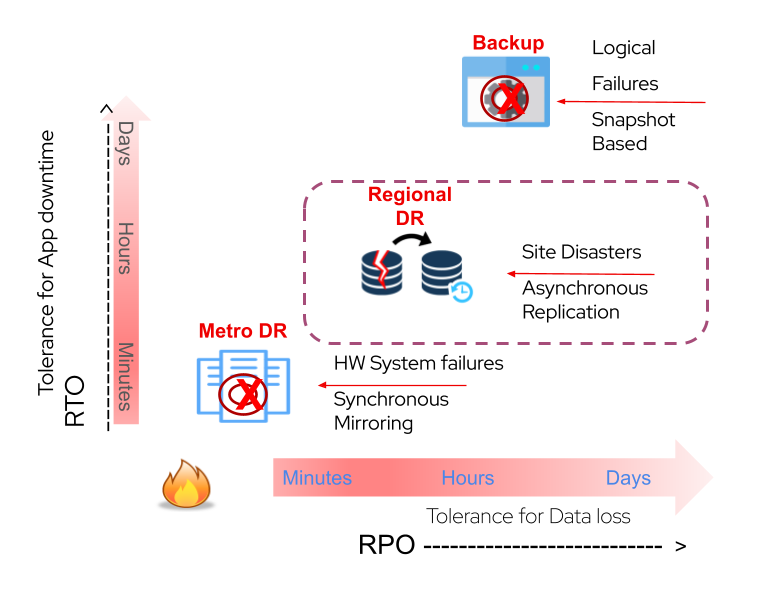

# Disaster Recovery Workshop

> *Welcome to the Disaster Recovery Workshop! This workshop is designed to help you understand and implement different disaster recovery (DR) strategies, each representing a unique combination of Recovery Time Objective (RTO) and Recovery Point Objective (RPO) values. We will explore various DR scenarios, including synchronous-mirroring, asynchronous replication, and snapshot-based backups.*

## Table of Contents

- [Disaster Recovery Workshop](#disaster-recovery-workshop)
  - [Table of Contents](#table-of-contents)
  - [Introduction](#introduction)
  - [Workshop Objectives](#workshop-objectives)
  - [Prerequisites](#prerequisites)
  - [DR Strategies](#dr-strategies)
  - [Getting Started](#getting-started)
  - [Workshop Materials](#workshop-materials)

## Introduction

Disaster recovery is a critical aspect of any organization's IT infrastructure. In this workshop, we will explore various strategies to ensure the availability of your systems in the face of disasters, system failures, or other unforeseen events. Understanding the concepts of RTO and RPO is essential to crafting effective DR solutions.

## Workshop Objectives

- Learn the fundamental concepts of Recovery Time Objective `(RTO)` and Recovery Point Objective `(RPO)`.
- Gain practical experience in implementing different DR strategies.
- Master the techniques involved in Disaster Recovery's products.
- Develop the skills to assess and choose the most suitable DR strategy for your organization.

## Prerequisites

Before diving into the workshop, make sure you have the following prerequisites in place:

- A basic understanding of IT infrastructure and system administration.
- A basic understanding in cloud production envrionments
- Access to the necessary hardware and software environments for the workshop exercises (each stage require his own prerequisites).

## DR Strategies

In this workshop, we will cover three main disaster recovery strategies, each with its own unique combination of RTO and RPO values and his dedicated tools.

> ### [Synchronous-Mirroing (Active-Active))](stage1/README.md)

The active-active strategy focuses on **maintaining high availability** by distributing workload across multiple systems. In this section, you will learn how to set up and configure an active-active environment.

> ### [Asynchronous-Replication (Active-Passive)](stage2/README.md)

Asynchronous replication is a strategy that involves **periodic data synchronization** between primary and secondary sites. We will guide you through setting up asynchronous replication to minimize data loss in case of a disaster.

> ### [ Snapshot-Based](stage3/README.md)

Snapshot-Based as known as "Cold" backups involve regular data backups **with a longer RTO**. You will learn how to create and manage scheduled backups to ensure data integrity and availability in the event of a failure.

## Getting Started

To begin the workshop, navigate to the specific strategy folders (e.g., "active-active," "asynchronous-replication," or "snapshot-based") for step-by-step instructions.
   

## Workshop Materials

In each strategy folder, you will find **detailed documentation, code samples, and configurations** to help you implement the disaster recovery strategies. Feel free to explore and experiment with the provided materials.

*Enjoy the Disaster Recovery Workshop, and may your systems always stay resilient!*

