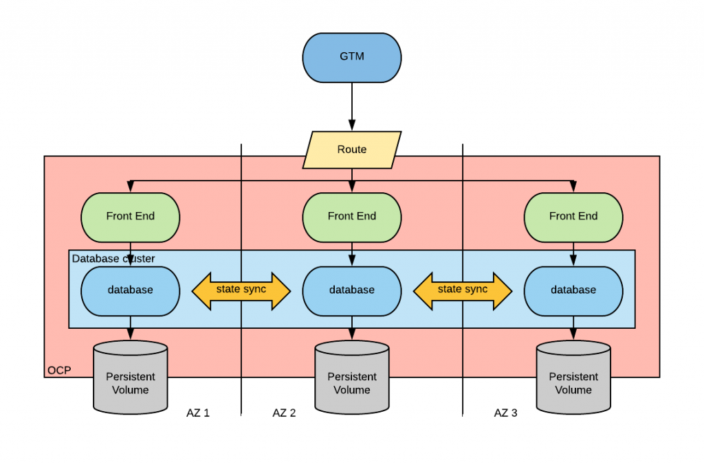

# Workshop Stage 1: Stretching Cluster Strategy

## Introduction
Welcome to the first stage !
In this stage of the workshop, we will delve into the stretching cluster strategy, exploring its advantages, and understanding its impact on Recovery Time Objective (RTO) and Recovery Point Objective (RPO). We will also provide a step-by-step implementation guide, focusing on the deployment of a RocketChat application, a 'MongoDB' database, and configuring database replicas.

## Advantages of Stretching Cluster Strategy
In the Stretched Design Model, both Control Plane Nodes and Worker Nodes within a Kubernetes Cluster are deployed across multiple data centers interconnected by high bandwidth, low latency fiber optics cables. For detailed insights into the characteristics and requirements of each Kubernetes Control Plane Component, please refer to previous sessions of this series.

The primary goal of the Stretched Cluster Design is to enhance the resilience of Kubernetes Clusters against failures at the datacenter level. To establish a Production Ready Kubernetes Stretched Cluster, it's imperative to have three independent failure domains geographically dispersed (such as three separate data centers) with low latency connectivity.

a

The stretching cluster strategy offers several advantages:
- **High Availability**: By spreading resources across multiple geographical locations, it ensures continuous availability even in the event of a disaster in one location.
- **Disaster Recovery**: Enables seamless failover to a secondary site, minimizing downtime and data loss.
- **Load Distribution**: Distributes workload across multiple sites, optimizing resource utilization and improving performance.

## Impact on RTO and RPO
- **Recovery Time Objective (RTO)**: The time it takes to recover after a disaster. With a stretching cluster strategy, RTO is significantly reduced as failover to a secondary site can occur almost instantaneously.
- **Recovery Point Objective (RPO)**: The acceptable amount of data loss measured in time. With stretching clusters, RPO is minimized as data is replicated synchronously or asynchronously between sites, ensuring minimal data loss.

Note: For Organizations building and Operating their own Data Centers, the approach increases the Cost and Complexity by manifolds, especially Network Connectivity between at least three DataCenters to meet the low latency and resiliency. 
## Implementation Guide
### Prerequisites
- Min Three diffrent zones seregated into three Data Ceneters with Independent failure Domains
- Each one of the Control Plane's Nodes are deployed at spereate zone.
- Round Trip TIme (RTT) between the zones MUST be lower then '10 miili seconds'.
- RedHat OpenShift cluster set up with nodes across multiple geographical locations.
- Access to RedHat container registry and repositories.
### High Level Design

a
### Deployment Steps
1. **Deploy MongoDB Database**:
   1.1 Validate the control plane and data plane are deployed at seperated zones:
   ``` bash
   oc get nodes -o=jsonpath='{range .items[*]}{.metadata.name}{"\t"}{.metadata.labels.zone}{"\n"}{end}'
   ```
   a

   1.2 Clone the repo and deploy the rocket-chat application
   ``` bash
    git clone && cd stage1
   oc project $USERNAME-rocketchat 
   oc apply -f manifests/01-mongo-deployment.yaml

   ```
   a
   As shown at the diagrm we now created a headless service and a MongoDB statefulset as the first step for creating our DB-replicaset, headless service is 
``` bash
oc get pods -o wide
```
    We can see all the DB's pods are sperated (one each node) which means..*one at each Zone*.
   a

2. **Configure Database Replicas**:
   2.1 In order to initate MongoDB's replicaset, apply the Job.
    ``` bash
   oc apply -f manifests/02-initialize-rs-job.yaml

   ```
   The Job will initiate a MongoDB replica set using 'rs.initiate'. It initializes a replica set named "rs0" with three members.

   
  
3. **Deploy RocketChat Application**:
  3.1 Deploy RocketChat by creating deployment, service and a route for the application.
  ``` bash
   oc apply -f manifests/03-rocketchat-deployment.yaml

   ```

    Keep with the insturctions and configure the application.
    When reaching out to the chat, create a new channel and a messeage in order to create some data which will be tested later as part of out recovery strategy.


### Real-Life Scenario Simulation
- Simulate a disaster scenario such as hardware failure in one geographical location or even If we want to live at the edge, let's assume two of our Data Centers are having a disaster scenrio right now.
- You are free to destroy two workers nodes selected randomly, you can destory them one by one or two at the same time.
- Remain your session connected to the app and meanwhile the disaster knocking at your door just relax and see how secured your application is.

a

## Conclusion
In this stage, we explored the stretching cluster strategy, highlighting its advantages and impact on RTO and RPO. Through a step-by-step implementation guide and real-life scenario simulation, we demonstrated the resilience and reliability of this approach using application and a DB's replicaset. Stay tuned for the next stage where we will delve deeper into alternative DR strategies.
