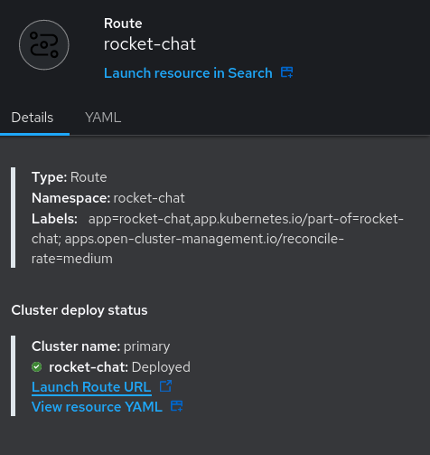

# Disaster Recovery Workshop - Stage 2: Asynchronous Replication

Welcome to the second stage of the Disaster Recovery Workshop. In this stage, we will explore the concept of Asynchronous Replication as a disaster recovery strategy. Asynchronous replication is a method that involves periodic data synchronization between primary and secondary sites, helping minimize data loss in the event of a disaster.

## Table of Contents

- [Disaster Recovery Workshop - Stage 2: Asynchronous Replication](#disaster-recovery-workshop---stage-2-asynchronous-replication)
  - [Table of Contents](#table-of-contents)
  - [Introduction](#introduction)
  - [Asynchronous Replication Overview](#asynchronous-replication-overview)
  - [Additonal Solution](#additonal-solution)
    - [Components of Regional-DR solution](#components-of-regional-dr-solution)
  - [Simulated Scenario: Rocket.Chat Disaster Recovery](#simulated-scenario-rocketchat-disaster-recovery)
      - [Your Role and Responsibilities](#your-role-and-responsibilities)
      - [Prerequisets](#prerequisets)
  - [Implementation Guidelines](#implementation-guidelines)
    - [Configure Async](#configure-async)
      - [1. Go to the OpenShift Hub's console and log in with the given by the instructor credintials](#1-go-to-the-openshift-hubs-console-and-log-in-with-the-given-by-the-instructor-credintials)
      - [2. Verify ACM and managed clusters status](#2-verify-acm-and-managed-clusters-status)
      - [3. Validate ODF-Multicluster on the hub clusters](#3-validate-odf-multicluster-on-the-hub-clusters)
      - [4. Validate ODF on the managed clusters](#4-validate-odf-on-the-managed-clusters)
      - [5. Create a Data Policy (DRpolicy)](#5-create-a-data-policy-drpolicy)
    - [Deploy Rocket.Chat](#deploy-rocketchat)
      - [Rocket.Chat Usage in Primary OpenShift Cluster](#rocketchat-usage-in-primary-openshift-cluster)
      - [1. Go to the Hub OpenShift console and log in](#1-go-to-the-hub-openshift-console-and-log-in)
      - [2. Deploy the application](#2-deploy-the-application)
      - [3. Configure the application](#3-configure-the-application)
    - [4. Bind the application to the DRpolicy](#4-bind-the-application-to-the-drpolicy)
    - [5. Use the application](#5-use-the-application)
  - [Disaster ALERT !!](#disaster-alert-)
    - [6. Preform FailOver to the secondary cluster](#6-preform-failover-to-the-secondary-cluster)
    - [7. Relocate to the Primary Site](#7-relocate-to-the-primary-site)
  - [:confetti\_ball: You accomplished this stage successfully :confetti\_ball:](#confetti_ball-you-accomplished-this-stage-successfully-confetti_ball)

## Introduction

Asynchronous replication is a critical part of your disaster recovery strategy. It enables you to maintain data consistency and minimize data loss even in the face of unexpected outages. As our journay continues At this stage you will be exposed and you will be guide through a simulated scenario, illustrating how to implement asynchronous replication with a real-world application, Rocket.Chat, deployed from a `Hub-cluster` (ACM) to a primary `OpenShift cluster`. We will also leverage the `Open Data Foundation` (ODF) Multi-Cluster and `OpenShift DR` Operator with a specific `DRpolicy` to execute a failover to a secondary cluster.

## Asynchronous Replication Overview

a

Asynchronous replication involves the following key concepts:

- **Primary and Secondary Clusters**: The primary cluster holds the primary version of the application and data, while the secondary cluster is the target for replication.

- **Replication Lag**: In asynchronous replication, there may be a delay (lag) between changes made in the primary cluster and when they are replicated to the secondary cluster. This lag is typically measured in time, such as seconds or minutes.

In the context of Asynchronous Replication, it's essential to understand the specific implications of `Recovery Point Objective (RPO) and Recovery Time Objective (RTO)`:

- **Recovery Point Objective (RPO)**: In the case of Asynchronous Replication, RPO represents the acceptable threshold for data loss. Since data changes are asynchronously replicated from the primary cluster to the secondary cluster, there is a potential for a lag in synchronization. The RPO for this strategy determines how much data your organization can afford to lose in the event of a disaster. For example, if your RPO is set to 1 hour, it means that in the worst-case scenario, the secondary cluster might lag behind the primary cluster by up to one hour's worth of data changes. Beyond this threshold, data loss may occur.

- **Recovery Time Objective (RTO)**: RTO defines the maximum acceptable duration of downtime and the time it takes to recover from a disaster to restore normal operations. In the context of Asynchronous Replication, the RTO accounts for the time it takes to activate the secondary cluster, ensure data consistency, and switch to it as the primary source of operations. RTO is critical in determining how quickly your organization can resume full functionality after a disaster.

Balancing RPO and RTO is essential in designing your disaster recovery strategy, as they represent the trade-off between data consistency and recovery speed. The choice of RPO and RTO values should align with your organization's tolerance for data loss and its operational requirements.

## Additonal Solution

Our solution, Including [Red Hat Advanced Cluster Management for Kubernetes (RHACM)](https://) and [OpenShift Data Foundation ](https://)components, is designed to deliver application and data mobility across OpenShift Container Platform clusters. It operates on an **asynchronous data replication model**, which means there is a potential for data loss. However, it offers robust protection against a wide range of failures.

One of the standout features of this solution is its capability to provide an automated "one-click" recovery process in the event of <span style="color: #FF5733;">a regional disaster.</span>
This means that protected applications are automatically redeployed to a designated OpenShift Container Platform with OpenShift Data Foundation cluster located in another region, ensuring minimal downtime.

The primary purpose of this guide is to understand the implementation aspects necessary to be able to **failover an application from one OpenShift Container Platform (OCP) cluster to another and then failback the same application to the original primary cluster.** In this case the OCP clusters will be created or imported using Red Hat Advanced Cluster Management (ACM).

This is a general overview of the steps that will be executed by OpenShift Disaster Recovery (ODR) capabilities using OpenShift Data Foundation (ODF) v4.12 and RHACM v2.7 across two distinct OCP clusters separated by distance. 


### Components of Regional-DR solution
> #### Red Hat Advanced Cluster Management for Kubernetes
```
Red Hat Advanced Cluster Management (RHACM) provides the ability to manage multiple clusters and application lifecycles. Hence, it serves as a control plane in a multi-cluster environment.

RHACM: includes components that run on the multi-cluster control plane.`
```
> #### Openshift Clusters (Primary & Secondary)
```
Two Managed clusters: includes components that run on the clusters that are managed.
```


> #### OpenShift Data Foundation
```
OpenShift Data Foundation provides the ability to provision and manage storage for stateful applications in an OpenShift Container Platform cluster.

OpenShift Data Foundation is backed by Ceph as the storage provider, whose lifecycle is managed by Rook in the OpenShift Data Foundation component stack. Ceph-CSI provides the provisioning and management of Persistent Volumes for stateful applications.

OpenShift Data Foundation stack is now enhanced with the following abilities for disaster recovery:

- Enable RBD block pools for mirroring across OpenShift Data Foundation instances (clusters)

- Ability to mirror specific images within an RBD block pool

- Provides csi-addons to manage per Persistent Volume Claim (PVC) mirroring
```

> #### OpenShift DR
> 
```
OpenShift DR is a set of orchestrators to configure and manage stateful applications across a set of peer OpenShift clusters which are managed using RHACM and provides cloud-native interfaces to orchestrate the life-cycle of an application’s state on Persistent Volumes. These include:

 - Protecting an application and its state relationship across OpenShift clusters

-  Failing over an application and its state to a peer cluster

-  Relocate an application and its state to the previously deployed cluster

OpenShift DR is split into three components:

- ODF Multicluster Orchestrator: Installed on the multi-cluster control plane (RHACM Hub), it orchestrates configuration and peering of OpenShift Data Foundation clusters for Metro and Regional DR relationships

- OpenShift DR Hub Operator: Automatically installed as part
of ODF Multicluster Orchestrator installation on the hub cluster to orchestrate failover or relocation of DR enabled applications.

- OpenShift DR Cluster Operator: Automatically installed on each managed cluster that is part of a Metro and Regional DR relationship to manage the lifecycle of all PVCs of an application.

```

## Simulated Scenario: Rocket.Chat Disaster Recovery

In this scenario, you are a Site Reliability Engineer (SRE) in a TechConnect Innovations Company, a rapidly growing tech firm that relies heavily on real-time communication for project collaboration. As an SRE, ensuring high availability and data resilience is your top priority. Rocket.Chat, a popular chat and collaboration platform, plays a crucial role in your company's daily operations.

#### Your Role and Responsibilities

- As the SRE, you are responsible for managing and maintaining the infrastructure supporting Rocket.Chat.
- Your goal is to ensure that Rocket.Chat is highly available and that data integrity is preserved, even in the face of unexpected disasters.
- To achieve this, you must implement a robust disaster recovery strategy for Rocket.Chat.

**You need to ensure that Rocket.Chat's data is replicated to a secondary OpenShift cluster to minimize data loss in the event of primary cluster failures or disasters.**

#### Prerequisets

- [x] 3 Openshift-Clusters with admin access on each one of them.
- [x] Installed ACM operator on the hub cluster.
- [x] Import managed OCP clusters into ACM hub (or create them for it).
- [x] ODF Deployed on the both managed clusters.
- [x] The primary and secondary OCP clusters have unique private network address ranges.
- [x] Installed ODF Multicluster Orchestrator on the ACM hub cluster.
- [x] Deployed OpenShift DR Hub operator.
- [x] Configured SSL access between S3 endpoints.
- [x] DRPolicy CR created.


## Implementation Guidelines

To implement asynchronous replication for Rocket.Chat from the primary OpenShift cluster to the secondary OpenShift cluster, we will use the Open Data Foundation (ODF) Multi-Cluster and OpenShift DR Operator with a specific DR policy.

Follow the step-by-step guidelines in the "asynchronous-replication" folder to set up and configure asynchronous replication between the primary and the secondary cluster.

### Configure Async 

#### 1. Go to the OpenShift Hub's console and log in with the given by the instructor credintials  

#### 2. Verify ACM and managed clusters status
Navigate and Click `ALL CLUSTERS`, then go to `InfraSturcture` -> `Clusters`, select `Cluster Sets` tab and in cluster sets select `clusterset1` 


#### 3. Validate ODF-Multicluster on the hub clusters
3.1 login to the primary cluster:
```bash
oc login -u <user-name> -p <password> <-hub-cluster-api>
```
3.2 Validate controller pods are at 'Running' statu:
```bash
oc get pods -n openshift-operators
```
#### 4. Validate ODF on the managed clusters
4.1 login to the primary cluster:
```bash
oc login -u <user-name> -p <password> <-primary-cluster-api>
```
4.2 Validate storagecluster status:
```bash
oc get storagecluster -n openshift-storage ocs-storagecluster -o jsonpath='{.status.phase}{"\n"}'
```
4.3 Validate ODF's Multi-Cluster Gateway (MCG)
```bash   
oc get noobaa -n openshift-storage noobaa -o jsonpath='{.status.phase}{"\n"}'
```
4.4 login to the secondary cluster:
```bash
oc login -u <user-name> -p <password> <-secondary-cluster-api>
```
4.5 Validate storagecluster status:
```bash
oc get storagecluster -n openshift-storage ocs-storagecluster -o jsonpath='{.status.phase}{"\n"}'
```
4.6 Validate ODF's Multi-Cluster Gateway (MCG)
```bash   
oc get noobaa -n openshift-storage noobaa -o jsonpath='{.status.phase}{"\n"}'
```
#### 5. Create a Data Policy (DRpolicy)

The DRPolicy resources used at the Hub cluster level to failover and relocate workloads across managed clusters. A DRPolicy requires a set of peer clusters with ODF at least version 4.12 installed. The ODF MultiCluster Orchestrator Operator facilitates the creation of each DRPolicy and the corresponding 

5.1 Log into the hub cluster.
5.2 Navigate to Data Services and click Data policies.
5.3 Click Create DRPolicy.
5.4 Enter Policy name. Ensure that each DRPolicy has a unique name.
5.5 Select two clusters from the list of managed clusters to which this new policy will be associated with.
5.6 Click 'Create'.
   
   
   
*Alternatively you can use OC CLI and type:*
```bash
oc apply -f RH-DISASTER-RECOVERY-WORKSHOP/stage2/manifests/DRPolicy.yaml
```
`DRPolicy.yaml`

```yaml
apiVersion: ramendr.openshift.io/v1alpha1
kind: DRPolicy
metadata:
  finalizers:
    - drpolicies.ramendr.openshift.io/ramen
  labels:
    cluster.open-cluster-management.io/backup: resource
  name: rh-dr-demo
spec:
  drClusters:
    - primary # List of DRCluster resources that are governed by this policy
    - secondary
  replicationClassSelector: {} #Label selector to identify all the VolumeReplicationClasses
  schedulingInterval: 5m #scheduling Interval for replicating Persistent Volume data to a peer cluster.
  volumeSnapshotClassSelector: {} #Label selector to identify all the VolumeSnapshotClasses
  ```

5.6 Verify that the DRPolicy is created successfully. Run this command on the Hub cluster for each of the DRPolicy resources created
```bash  
oc get drpolicy rh-dr-demo -o jsonpath='{.status.conditions[].reason}{"\n"}'
```


Creating a DR Policy will generate two `DRCluster` CustomResources. In addition, when the initial DRPolicy is created the following steps will be executed happen:

- Create a bootstrap token and exchanges this token between the managed clusters.

- Enable mirroring for the default CephBlockPool on each managed clusters.

- Create a VolumeReplicationClass on the Primary managed cluster and the Secondary managed cluster for the replication interval in the DRPolicy.

- An object bucket created (using MCG) on each managed cluster for storing PVC and PV metadata.

- A Secret created in the openshift-operators project on the Hub cluster for each new object bucket that has the base64 encoded access keys.

- The ramen-hub-operator-config ConfigMap on the Hub cluster is modified with s3StoreProfiles entries.

- The OpenShift DR Cluster operator will be deployed on each managed cluster in the openshift-dr-system project.

- The object buckets Secrets on the Hub cluster in the project openshift-operators will be copied to the managed clusters in the openshift-dr-system project.

- The s3StoreProfiles entries will be copied to the managed clusters and used to modify the ramen-dr-cluster-operator-config ConfigMap in the openshift-dr-system project.

5.7 Validate S3 access for the DRcluster resource:


```bash
oc get drcluster <CR-name> -o jsonpath='{.status.conditions[2].reason}{"\n"}'
```

5.8 Validate the status of the ODF mirroring daemon health on the managed cluster.

```bash
oc login -u <user-name> -p <password> <-primary-cluster-api>
```
```bash
oc get cephblockpool ocs-storagecluster-cephblockpool -n openshift-storage -o jsonpath='{.status.mirroringStatus.summary}{"\n"}'
```
```bash
oc login -u <user-name> -p <password> <secondary-cluster-api>
```
```bash
oc get cephblockpool ocs-storagecluster-cephblockpool -n openshift-storage -o jsonpath='{.status.mirroringStatus.summary}{"\n"}'
```

> We are now ready! for disaster scenrio and we ensured that it will failover as well as failback(relocate) successfully while maintaining persistent data consistency and availability.


### Deploy Rocket.Chat  
####  Rocket.Chat Usage in Primary OpenShift Cluster

- Rocket.Chat need to be deployed in the primary OpenShift cluster, and it serves as the primary source for all communication and collaboration in our company
- Critical chat data, including project updates, discussions, and user interactions, are stored in the primary cluster.
- Rocket.Chat undergoes frequent changes, with new messages and updates being added constantly.

#### 1. Go to the Hub OpenShift console and log in 


#### 2. Deploy the application
2.1 Access the RHACM plaftorm by clicking local-cluster from the left menu and then selecting `All Clusters`.


2.2 You will now need to create your application which we willuse in this workshop. Click on Applications on the left menu and click Create application→Subscription


#### 3. Configure the application

3.3 Hit on 'Create' once again in order to deploy the application.

3.4 Wait for the screen to appear in the following status


3.5 Click on the Route resource and then on the 'Launch Route' buttom.



3.6 Fill the addtional information to create yourself a user and configure the instance (Please Remember your password)


3.7 Hit the 'Go to your workspace' buttom, your Rocket.Chat is ready!


### 4. Bind the application to the DRpolicy

4.1 Return to the RHACM Hub console and then click Data Services→Data policies from the left menu.

4.2 Click on the 3 dots on the disaster recovery policy we pre-created and select Apply DRPolicy.


4.3 Tik the rocket-chat application and enter the label `app=rocket-chat`


4.4 Press 'Apply' to confirm the binding.

4.5 Login to the passive cluster

4.6  Create the rocket-chat namespace in the secondary cluster and annotate it with the subscription name.
```bash
oc new-project rocket-chat || oc project rocket-chat
oc annotate ns rocket-chat --overwrite=true apps.open-cluster-management.io/hosting-subscription=rocket-chat/rocket-chat-subscription-1
```
### 5. Use the application

5.1 Navigate to the Rocket.Chat application.
Can be done by the method we used before (through ACM's applications)

5.2 Let's generate some data by sending custom messeages and create channels


##  <span style="color: #FF5733;">Disaster ALERT !!</span>


***a Catastrophic event just happend ! Severe power outage, has caused the primary data center to become inoperable. The networking infrastructure, servers, and power supply have been severely affected, rendering the Primary Cluster  inaccessible.***

Lucky us we have you in our company as our SRE Enginner.
Please prefrom a failover ASAP !!

### 6. Preform FailOver to the secondary cluster

6.1 Switch back to the RHACM's console and select Applications and filter on Subscription. Click the 3 dots at the end of the rocket-chat application and select Failover application.


6.2 Apply the failover by pressing the 'Initate' buttom.


6.3 You will notice that the pods on the primary cluster in the rocket-chat namespace will start terminating as the app starts failing over.

6.4 Log in to the secondary cluster.

6.5 Once logged in click Workloads→Pods on the left menu. Ensure your selected project is rocket-chat. Notice that the application pods have been recreated in this namespace.

6.6 Review the status of the pvc and the cephblockpool on secondary. The health may be temporary in warning state and then goes back to healthy state
```bash
oc get cephblockpool ocs-storagecluster-cephblockpool -n openshift-storage -o jsonpath='{.status.mirroringStatus.summary}{"\n"}'
```
6.7 Next navigate to the 'rocket-chat' Namespace, click Networking→Routes on the left menu and then click on the Location link of the rocket-chat route

Or you can use OC CLI: 
```bash
oc get route -n rocket-chat 
```
Type the url into your web-browser.


Excellent ! you made it :)

We just minimaized our RTO and the DRpolicy decreased our RPO !!

### 7. Relocate to the Primary Site

Okay the site-manitanance activety has completed and you need to migrate our application back to his orginal cluster.
In order to accomplish that you need to execute a `Relocate`

> A 'relocation' operation is very similar to failover. Relocate is application based and uses the DRPlacementControl to trigger the relocation. The main difference for relocation is that a resync is issued to make sure any new application data saved on the Secondary managed cluster is immediately, not waiting for the mirroring schedule interval, replicated to the Primary managed cluster.

7.1 Go back to the Hub Cluster RHACM console.

7.2 Applications and filter on Subscription. Click the 3 dots at the end of the rocket-chat application and select 'Relocate application'.


7.3 Provide the following details on the popup:

- Select policy: `rh-dr-demo`

- Target cluster: `primary`

- Select subscriptions group: `rocket-chat-subscription-1`

7.4 the pods on the secondary cluster in the rocket-chat namespace will start terminating and will be relocated at the Primary cluster.

##  :confetti_ball: You accomplished this stage successfully :confetti_ball:


