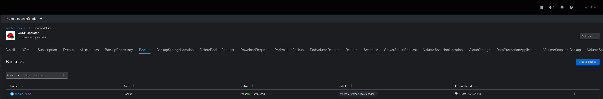
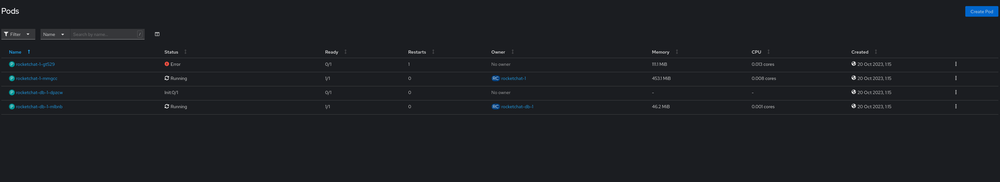
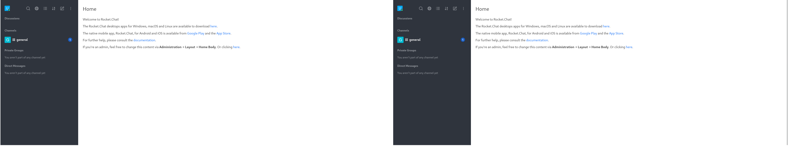
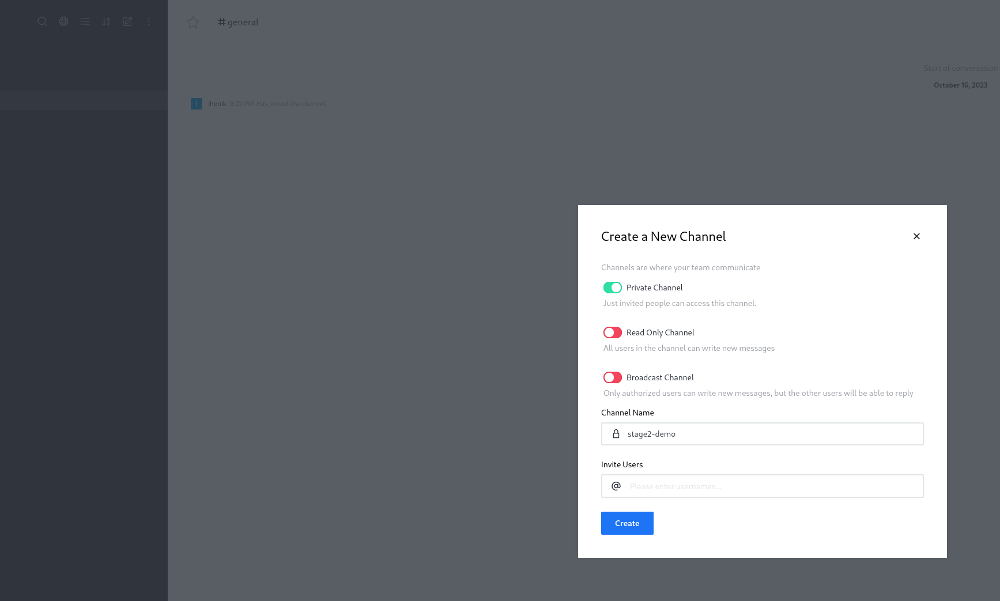
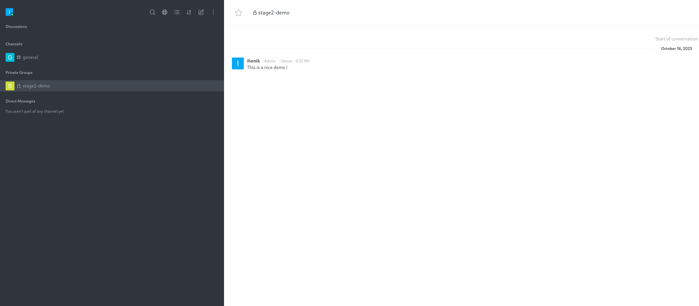
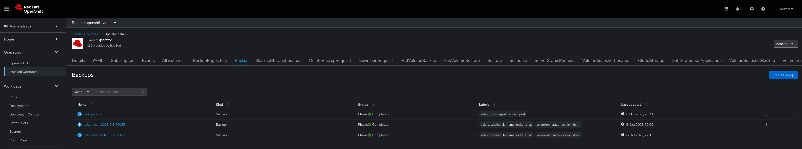
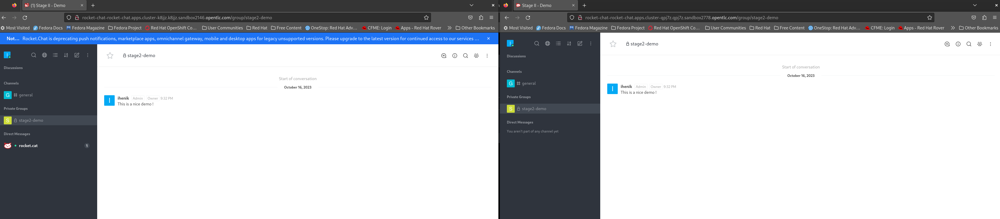

# Disaster Recovery Workshop - Stage 3: "Cold" Snapshot

> Welcome to the third stage of the Disaster Recovery Workshop. In this stage, we will explore the "cold" snapshot disaster recovery strategy. Unlike the previous stages that leveraged active-active configurations and asynchronous replication, the "cold" snapshot strategy involves intermittent backups to minimize data loss and facilitate a quick recovery.

## Table of Contents

- [Disaster Recovery Workshop - Stage 3: "Cold" Snapshot](#disaster-recovery-workshop---stage-3-cold-snapshot)
  - [Table of Contents](#table-of-contents)
  - [Introduction](#introduction)
  - [Cold Snapshot Overview](#cold-snapshot-overview)
  - [Async vs Snapshot based](#async-vs-snapshot-based)
  - [Simulated Scenarios](#simulated-scenarios)
  - [Prerequisites](#prerequisites)
  - [Implementation Guidelines](#implementation-guidelines)
  - [What is OADP ?](#what-is-oadp-)
    - [What is OADP](#what-is-oadp)
    - [Backup Workflow](#backup-workflow)
    - [Restore Workflow](#restore-workflow)
    - [Object Storage Sync](#object-storage-sync)
    - [Backup file format](#backup-file-format)
    - [Scenario 1: Manual Backup and Restore](#scenario-1-manual-backup-and-restore)
    - [1. Deploy RocketChat on the Source Cluster](#1-deploy-rocketchat-on-the-source-cluster)
    - [1. Confgiure OADP](#1-confgiure-oadp)
    - [4. Configure the passive cluster](#4-configure-the-passive-cluster)
    - [5. Preform a Restore at the passive cluster](#5-preform-a-restore-at-the-passive-cluster)
    - [Scenario 2: Scheduled Backups with OADP](#scenario-2-scheduled-backups-with-oadp)
    - [1. At the primary cluster create a Schedule CR](#1-at-the-primary-cluster-create-a-schedule-cr)
    - [2. Creating a scheduled Restore at the passive-cluster](#2-creating-a-scheduled-restore-at-the-passive-cluster)
  - [Stage Accomplished :ballot\_box\_with\_check:](#stage-accomplished-ballot_box_with_check)

## Introduction

The "cold" snapshot disaster recovery strategy involves taking periodic snapshots or backups of your application's data, providing a reliable point-in-time recovery solution. This strategy is characterized by its manual or scheduled execution of backup and restore operations.

## Cold Snapshot Overview

Key concepts of the "cold" snapshot strategy:

- **Periodic Backups**: Scheduled backups are taken at predefined intervals to capture the current state of the application and its data.

- **Quick Recovery**: In the event of a disaster, the application can be swiftly recovered using the latest available snapshot.

- **Potential Data Loss**: As backups are taken periodically, there is a potential for data loss equivalent to the time between two consecutive backups or in another words offering a trade-off between recovery speed and potential data loss.

## Async vs Snapshot based

| Aspect                           | "Cold" Snapshot Strategy                                 | Asynchronous Replication Strategy                           |
| -------------------------------- | ------------------------------------------------------- | ---------------------------------------------------------- |
| **Backup Frequency**              | Backups are taken periodically at predefined intervals. | Continuous synchronization of data between primary and secondary clusters. |
| **Recovery Point Objective (RPO)**| Determined by the time between two consecutive backups.   | Typically shorter as data changes are immediately replicated to the secondary system. |
| **Recovery Time Objective (RTO)**| Quick recovery is possible using the latest available snapshot. | Generally shorter due to near real-time synchronization.   |
| **Data Synchronization**          | Backups are taken independently of data changes.         | Continuous synchronization provides a more real-time reflection of the primary system. |
| **Backup Mechanism**              | Primary focus on periodic backups for data capture.      | Emphasis on continuous data synchronization with backups as a complementary aspect. |


## Simulated Scenarios

In this stage, we will simulate two real-life scenarios for the "cold" snapshot strategy. Each scenario represents a unique approach to implementing and executing the disaster recovery plan.

## Prerequisites

Before you begin, ensure you have the following prerequisites in place:

- Access to two OpenShift clusters with an admin premissions: a source cluster and a target cluster.
- The OADP Operator installed on both clusters.
- S3 access.


## Implementation Guidelines

To implement the "cold" snapshot disaster recovery strategy for Rocket.Chat, follow the step-by-step guidelines in the respective scenario folders. These guidelines cover both manual execution and automation using scheduled backups with OADP.

## What is OADP ?

### What is OADP

OADP is the OpenShift API for Data Protection operator. This open source operator sets up and installs Velero on the OpenShift platform, allowing users to backup and restore applications.

### Backup Workflow 


    1. OADP using The Velero client makes a call to the Kubernetes API server to create a Backup object.

    2. The BackupController notices the new Backup object and performs validation.

    3. The BackupController begins the backup process. It collects the data to back up by querying the API server for resources.

    4. The BackupController makes a call to the object storage service – for example, AWS S3 – to upload the backup file.


### Restore Workflow

    1. The Velero client makes a call to the Kubernetes API server to create a Restore object.

    2. The RestoreController notices the new Restore object and performs validation.

    3. The RestoreController fetches the backup information from the object storage service. It then runs some preprocessing on the backed up resources to make sure the resources will work on the new cluster. For example, using the backed-up API versions to verify that the restore resource will work on the target cluster.

    4. The RestoreController starts the restore process, restoring each eligible resource one at a time.

### Object Storage Sync

Object Storage Synchronization

Velero regards object storage as the authoritative data source, regularly verifying the presence of the correct backup resources. In cases where a properly formatted backup file exists in the storage bucket, yet there is no corresponding backup resource in the Kubernetes API, Velero ensures synchronization by transferring the information from object storage to Kubernetes

### Backup file format

A backup is a compressed tar file in gzip format, and its filename corresponds to the metadata.name defined during the creation of the Backup Custom Resource.

When utilizing cloud object storage, each backup file resides within its own subdirectory located in the bucket specified in the Velero server configuration. This subdirectory contains an additional file named 'velero-backup.json.' This JSON file encompasses all pertinent details about the associated Backup resource, including any default settings, providing a comprehensive historical record of the backup configuration. The JSON file also specifies the 'status.version,' which corresponds to the format of the output file.

### Scenario 1: Manual Backup and Restore

In this scenario, we will execute the "cold" snapshot strategy manually. We'll create backup and restore Custom Resources (CRs) to safeguard Rocket.Chat's critical data. The recovery will take place within the same OpenShift cluster.

Refer to the "cold-snapshot-manual" folder for detailed instructions.

### 1. Deploy RocketChat on the Source Cluster


1.1. Apply the YAML file to deploy the RocketChat application on the source cluster:
   ```bash
   git clone && cd stage3
   oc apply -f manifests/manifest.yaml
   ```
1.2 Setup the application.
   ```bash
   oc get route rocket-chat -n rocket-chat -ojsonpath="{.spec.host}"
   ```
   Insert the URL and keep with the setup guidelines.

  Hit on `Enter` to continue and keep a head with the guidelines.

### 1. Confgiure OADP

.2 Create Credentails secret for OADP operator to use.

```bash
oc create secret generic cloud-credentials --namespace openshift-adp --from-file cloud=secret.yaml
```
secret.yaml:

```yaml
[default]
aws_access_key_id=<INSERT_VALUE>
aws_secret_access_key=<INSERT_VALUE>
```
2.3 DataProtectionApplication (DPA) is the CR responsible for configure the s3 access and generate velero instance. Once it is deployed a velero instance pod will be created 

Create DataProtectionApplication (DPA) CR:
```bash
oc apply -f DataProtectionApplication.yaml
```
DataProtectionApplication.yaml:

```yaml
apiVersion: oadp.openshift.io/v1alpha1
kind: DataProtectionApplication
metadata:
  name: example-dpa
  namespace: openshift-adp
spec:
  configuration:
    velero:
      featureFlags:
        - EnableCSI
      defaultPlugins:
      - openshift
      - aws
      - csi
  backupLocations:
    - velero:
        default: true
        provider: aws
        credential:
            name: cloud-credentials
            key: cloud
        objectStorage:
            bucket: "oadp-bucket" #update this
            prefix: velero
        config:
            profile: default
            region: "localstorage"
            s3ForcePathStyle: "true"
            s3Url: "http://s3.openshift-storage.svc/" #update this if necessary
```
NOTE: you can use AWS/ODF/Minio or another provider velero support [support-matrix](https://velero.io/docs/v0.11.0/support-matrix/)

2.4 Modify VolumeSnapShotClass

The Velero CSI plugin, to backup CSI backed PVCs, will choose the VolumeSnapshotClass in the cluster that has the same driver name and also has the velero.io/csi-volumesnapshot-class: "true" label set on it.

```bash
oc patch volumesnapshotclass <volumesnapshotclass-name> --type=merge -p '{"deletionPolicy": "Retain"}'
oc label volumesnapshotclass <volumesnapshotclass-name> velero.io/csi-volumesnapshot-class="true"


### 3. Backup RocketChat from the Source Cluster
3.1 At this step, you have to create a Backup CR which will backup the required application.
```bash
oc apply -f Backup.yaml
```
Backup.yaml:

```yaml
apiVersion: velero.io/v1
kind: Backup
metadata:
  annotations:
    velero.io/source-cluster-k8s-gitversion: v1.25.12+ba5cc25
    velero.io/source-cluster-k8s-major-version: '1'
    velero.io/source-cluster-k8s-minor-version: '25'
  name: backup-demo-rocket-chat
  namespace: openshift-adp
  labels:
    velero.io/storage-location: dpa-1 #Location created by DPA's CR
spec:
  csiSnapshotTimeout: 10m0s
  defaultVolumesToFsBackup: true
  includedNamespaces: #Namespace it will backup
    - rocket-chat
  itemOperationTimeout: 1h0m0s
  storageLocation: dpa-1
  ttl: 720h0m0s
  volumeSnapshotLocations:
    - dpa-1
```
### 4. Configure the passive cluster

4.1 Create Credentails secret for OADP operator to use.

```bash
oc create secret generic cloud-credentials --namespace openshift-adp --from-file cloud=secret.yaml
```
secret.yaml:

```yaml
[default]
aws_access_key_id=<INSERT_VALUE>
aws_secret_access_key=<INSERT_VALUE>
```
4.2 Create DataProtectionApplication (DPA) CR:
```bash
oc apply -f DataProtectionApplication.yaml
```
DataProtectionApplication.yaml:

```yaml
apiVersion: oadp.openshift.io/v1alpha1
kind: DataProtectionApplication
metadata:
  name: dpa
  namespace: openshift-adp
spec:
  backupLocations:
    - velero:
        config:
          profile: default
          region: eu-west-1
        credential:
          key: cloud
          name: cloud-credentials #Secret name we created earlier
        default: true
        objectStorage:
          bucket: backup-demo-ihenik #BucketName
          prefix: backup-demo #PrefixName
        provider: aws
  configuration:
    restic:
      enable: true
    velero:
      defaultPlugins:
        - openshift
        - aws
        - csi
  snapshotLocations:
    - velero:
        config:
          profile: default
          region: eu-west-1
        provider: aws
```
4.3 Modify VolumeSnapShotClass

The Velero CSI plugin, to backup CSI backed PVCs, will choose the VolumeSnapshotClass in the cluster that has the same driver name and also has the velero.io/csi-volumesnapshot-class: "true" label set on it.

```bash
oc patch volumesnapshotclass <volumesnapshotclass-name> --type=merge -p '{"deletionPolicy": "Retain"}'
oc label volumesnapshotclass <volumesnapshotclass-name> velero.io/csi-volumesnapshot-class="true"
```
Great, now that all set we should be able to see under 'Backup' tab the backup we created at step 2.



### 5. Preform a Restore at the passive cluster
5.1 You know what to do now, In order to restore the backup you have to create a 'Restore' CR:
```bash
oc apply -f Restore.yaml
```
Restore.yaml:

```yaml
apiVersion: velero.io/v1
kind: Restore
metadata:
  name: restore-rocket-chat
  namespace: openshift-adp
spec:
  backupName: backup-demo-rocket-chat #Name of the backup you created eariler
  excludedResources:
    - nodes
    - events
    - events.events.k8s.io
    - backups.velero.io
    - restores.velero.io
    - resticrepositories.velero.io
    - csinodes.storage.k8s.io
    - volumeattachments.storage.k8s.io
    - backuprepositories.velero.io
  includedNamespaces:
    - rocket-chat #Restore mentioned NS
  itemOperationTimeout: 1h0m0s
  restorePVs: true #Restore the PVs as well
```
When you navigate to the application namespace (rocket-chat), you will encounter the following situation: 


But why does this occur? When OADP executes a restore flow, the `restore-controller` follows an `existingUpdatePolicy` as the default behavior. If the controller detects that the object already exists, it will skip the operation. In this case, we should modify the policy value to `update`, which instructs the controller to update the existing resources.

But there's more to it. As you probably know, an application might require specific pre-configuration tasks to function properly. 
That's why it's essential to characterize each backup carefully.

In our example, the MongoDB instance must initialize a replica set named "rs0" with a single member. To meet this requirement, we can utilize `restore-hooks`. These hooks will execute the specified command after the restore process has been completed inside a designated container.

5.2 Now after we learn few things let's deploy the Restore in the right way:
```bash
oc apply -f Restore.yaml
```
Restore.yaml:

```yaml
apiVersion: velero.io/v1
kind: Restore
metadata:
  name: restore-rocket-chat
  namespace: openshift-adp
spec:
  hooks:
    resources:
      - includedNamespaces:
          - rocket-chat
        labelSelector:
          matchExpressions:
            - key: posthook
              operator: Exists
        postHooks:
          - exec:
              command:
                - /bin/sh
                - '-c'
                - >-
                  sleep 60 && mongo rocket-chat-db:27017 --eval
                  "rs.initiate({_id: 'rs0', members: [{_id:0,
                  host:'localhost:27017'}]})"
              execTimeout: 1m
              waitTimeout: 5m
              onError: Fail
              container: rocketchat-db # which contianer to execute the hook on
        name: restore-hook-1
  backupName: backup-demo-rocket-chat
  existingResourcePolicy: update # if mentioned it will update resources and not skip if exsist
  restorePVs: true # allow to restore pvs
```
Now if you navigate to the app's routes in each cluster you need to see the following state:


Excellent ! but what happen when the application continues to write more data to the volume ? Manually executing this entire procedure can be quite daunting...

Let's see how to deal with that in the next scenriao

### Scenario 2: Scheduled Backups with OADP

In this scenario, we will automate the "cold" snapshot strategy by using scheduled backups and the OpenShift API Data Protection (OADP), also known as Velero. The backup will be restored not only within the same OpenShift cluster but also on a secondary OpenShift cluster for added resilience.


As mentioned earlier, applications naturally generate new data, modify existing data, and manually managing backups may not be the most efficient approach. This is particularly true **in the context of RTO and RPO where we definitely don't want to restore each component manually**. So, how do we address this? In this scenario, we will implement a **`scheduled`** backup and restore strategy.

First Let's create some data by creating a new channel and some messeages:



Now we have two un-synced applications:


### 1. At the primary cluster create a Schedule CR
```bash
oc apply -f Schedule.yaml
```
Schedule.yaml:

```yaml
  apiVersion: velero.io/v1
  kind: Schedule
  metadata:
    name: rocket-chat
    namespace: openshift-adp
  spec:
    schedule: '*/20 * * * * ' #schedule time
    template:
      defaultVolumesToFS: true
      hooks: {}
      includedNamespaces:
        - rocket-chat
      storageLocation: dpa-1
      ttl: 720h0m0s #backup-expried time
```
After creating this CR a backup will created schedually by the time-period you mentioned.



### 2. Creating a scheduled Restore at the passive-cluster

Unfortunately, OADP isn't equipped to schedule a restore, but don't fret, because good old cron jobs come to the rescue! :sunglasses:

2.1 Create a `crobjob` to restore schedullay the newest backup:
```bash
oc apply -f CronJob.yaml
```
CronJob.yaml:
```yaml
kind: CronJob
apiVersion: batch/v1
metadata:
  name: rocket-chat-updater
  namespace: openshift-adp
spec:
  schedule: '*/25 * * * *'
  concurrencyPolicy: Allow
  suspend: false
  jobTemplate:
    metadata:
      creationTimestamp: null
    spec:
      template:
        metadata:
          creationTimestamp: null
        spec:
          containers:
            - name: restore-schedule
              image: bitnami/kubectl
              command:
              - "/bin/sh"
              - "-c"
              - |
                kubectl delete pods --all -n rocket-chat
                # Capture the newest backup name
                NEWEST_BACKUP_NAME=$(kubectl get backups -n openshift-adp --sort-by=.metadata.creationTimestamp -o json | jq -r '.items[-1].metadata.name')

                # Create the Velero Restore CR with the captured backup name as the backupName
                cat <<EOF | kubectl apply -f -
                apiVersion: velero.io/v1
                kind: Restore
                metadata:
                  name: restore-rocket-chat
                  namespace: openshift-adp
                spec:
                  hooks:
                    resources:
                      - name: restore-hook-1
                        includedNamespaces:
                          - rocket-chat
                        labelSelector:
                          matchExpressions:
                            - key: posthook
                              operator: Exists
                        postHooks:
                          - exec:
                              command:
                                - /bin/sh
                                - '-c'
                                - >-
                                  sleep 60 && mongo rocket-chat-db:27017 --eval
                                  "rs.initiate({_id: 'rs0', members: [{_id:0,
                                  host:'localhost:27017'}]})"
                              execTimeout: 1m 
                              waitTimeout: 5m 
                              onError: Fail 
                              container: rocketchat-db # which contianer to execute the hook on 
                  existingResourcePolicy: update # if mentioned it will update resources and not skip if exsist 
                  restorePVs: true # allow to restore pvs
                  backupName: $NEWEST_BACKUP_NAME
                EOF
              resources: {}
              terminationMessagePath: /dev/termination-log
              terminationMessagePolicy: File
              imagePullPolicy: Always
          restartPolicy: OnFailure
          terminationGracePeriodSeconds: 30
          dnsPolicy: ClusterFirst
          serviceAccountName: velero
          serviceAccount: velero #use velero serviceaccount or create you own
          securityContext: {}
          schedulerName: default-scheduler
  successfulJobsHistoryLimit: 3
  failedJobsHistoryLimit: 1

```
If a disaster will happend, you're are now ready for it !
Every 25 mintues a new restore will be triggred, the restore will trigger a post-hook and as result we will recive an active-passive sync between the apps.


Note: In production environments, we configure a Global Load Balancer between the applications to ensure a seamless experience for our customers.

## Stage Accomplished :ballot_box_with_check:

So far, you've successfully completed basic stateful sets backups and restores, both locally and across clusters. You've also implemented a scheduling mechanism to reduce your RTO. 


